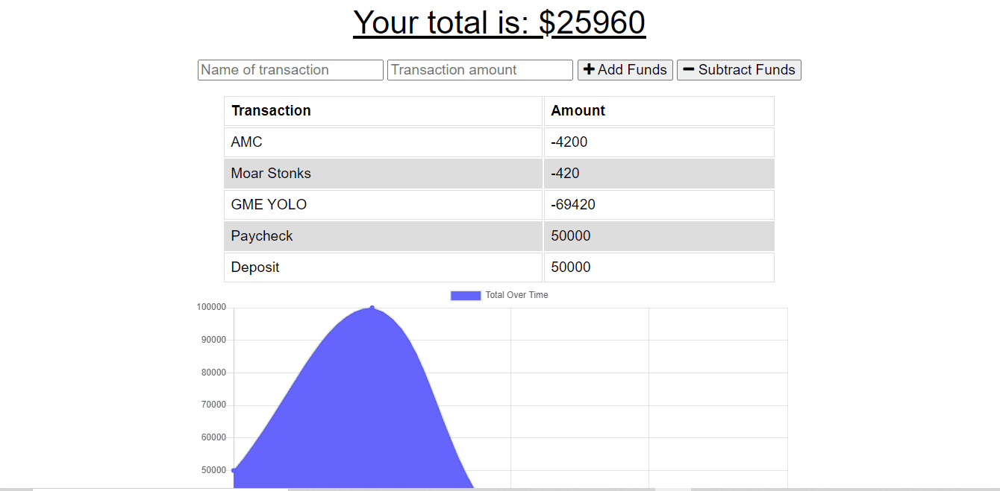

# Budget Tracker

An app for managing your transactions offline or online, by Seth Zygarlicke

### Links

* Github Repository: [https://github.com/ElderBass/Budget-Tracker.git](https://github.com/ElderBass/Budget-Tracker.git)
* Heroku Deployed: [https://whispering-depths-82087.herokuapp.com/](https://whispering-depths-82087.herokuapp.com/)

## Table of Contents


* [Description](#description)

* [Technologies](#technologies)
    
* [Installation](#installation)
    
* [Contributing](#contributing)
    
* [Questions](#questions)

## Description

Budget Tracker is a node/express application for managing your budget by catalouging your transactions, whether offline or online. 

The user opens the application and is directed to their home page. This page displays a table of the user's previous transactions (which might be empty upon initial startup) as well as a graph showing the transactions over time.

The user can document their transactions by simply filling out the form at the top. Enter the name of the transaction, the amount of money involved, and hit the corresponding button if it was subtracting or adding to your total funds. 

Upon entering a transaction, the table and chart will automatically update with date from the latest transaction. The beauty of this application is that it works both online and offline. 

Going offline, the application will work just as if the user was online. Thus, if flying for work, in a tunnel on the subway, or out in the middle of nowhere, you'll be able to update your budget regardless of location or wi-fi status. 

### Demonstration




## Technologies

Budget tracker is a node.js application that uses the express npm package to establish a connection to servers and develop routes between the client and server. Another critical dependency is the mongoose npm package, which allows the application to connect to the application's database stored in Mongo. 

One other package used in this application was nodemon, which allowed us to restart and render our application in real time after changes and saves.

All of the code was written in the VS Code program.  

## Installation

To install the many dependencies this application utilizes, open the server.js file a new integrated terminal in your VS Code and run the following command:

```
npm i
```

This will install every dependency contained within the package.json file.

## Contributing

If you wish to contribute to this repository, feel free to fork it to your local machine and do with it as you please.

## Questions 

If you have any questions or comments about this repo, email the creator Seth at [zygster11@gmail.com](zygster11@gmail.com)

For more projects by Seth, visit his Github page at [https://github.com/ElderBass](https://github.com/ElderBass)